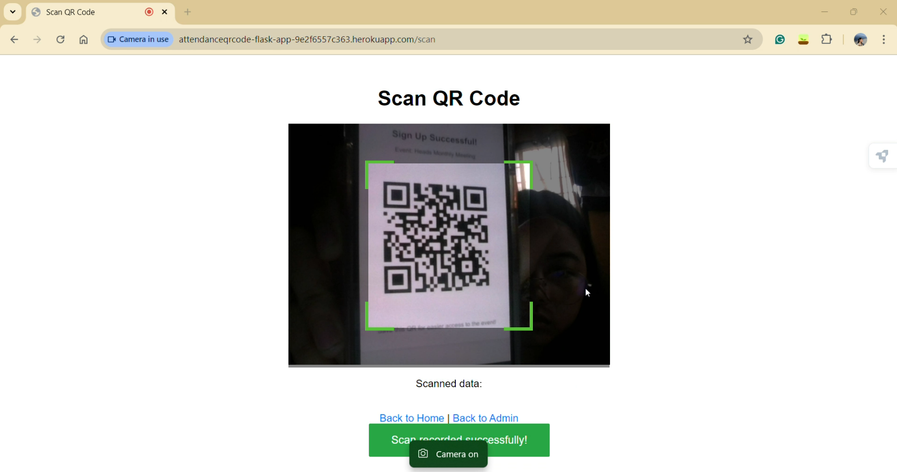
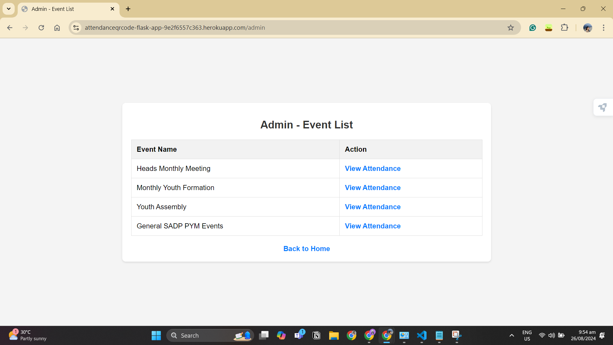
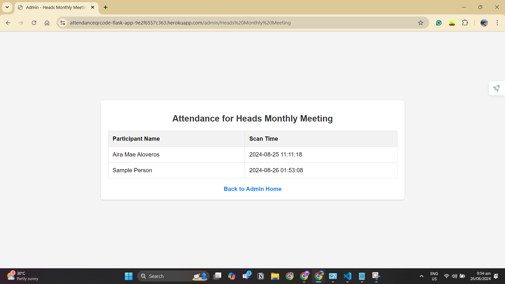

# Attendance QR Scanner

## Overview

This project was developed to streamline the registration process for our church events. With multiple attendees at each event, manually recording their information was time-consuming. By using this system, we can speed up and simplify the registration process through QR code scanning. Attendees sign up and receive a QR code, which we scan to quickly register their attendance.

## Features

- **Event Registration:** Attendees can sign up for events and receive a QR code.
- **QR Code Generation:** Generates a unique QR code for each attendee.
- **QR Code Scanning:** Allows us to scan QR codes to record attendance quickly.
- **Admin Dashboard:** Admins can view a list of events and see the attendees who were scanned at each event.

## Documentation
User's View:

| Path                           | Description                        | Image                                                             |
|--------------------------------|------------------------------------|-------------------------------------------------------------------|
| `/` - Homepage.                | Homepage                            |  |
| `/event/<event>` - Event Sign-up Page. | Event Sign-up Page                 |  |
| After successful registration, the attendee receives a QR code. | Generated QR Code                   |  |

Organizer's View
| Path                   | Description                                            | Image                                                                                       | Link                                                                                           |
|------------------------|--------------------------------------------------------|---------------------------------------------------------------------------------------------|------------------------------------------------------------------------------------------------|
| `/scan`                | Organizers can use the QR Code Scanner to record attendance. |                                  | [Watch the recording](https://drive.google.com/file/d/1Kvn_RkMkA3HMsbwoCneshM8K6XmsIWxa/view?usp=sharing) |
| `/admin`               | Admin Dashboard to view event details and attendee scans. Note that this has still no admin authentication. |                            |                                                                                                |
| `/admin/<event>`       | Event attendance details.                            |                 |                                                                                                |


## Tools Used

- **[Flask](https://flask.palletsprojects.com/):** A web framework for Python that helps in building web applications. It handles routing, rendering pages, and processing form data.
  
- **[qrcode](https://pypi.org/project/qrcode/):** A Python library for generating QR codes. It creates the QR codes that attendees use to register.

- **[SQLite](https://www.sqlite.org/index.html):** A lightweight database used to store participant and scan data. It is used here to manage and retrieve information about attendees and their scans.

- **[HTML5 QR Code Scanner](https://github.com/mebjas/html5-qrcode):** A JavaScript library for scanning QR codes directly from the web browser. It is used to read QR codes from the webcam.

- **[Heroku](https://www.heroku.com/):** A cloud platform that enables deployment of web applications. It is used to host the application online. The app is deployed at https://attendanceqrcode-flask-app-9e2f6557c363.herokuapp.com/.

## Installation

1. **Clone the Repository:**
   ```bash
   git clone https://github.com/ameaaira00/AttendanceQRScanner.git
   ```
   
2. **Navigate to the Project Directory:**
   ```bash
   cd AttendanceQRScanner
   ```

3. **Create and Activate a Virtual Environment:**
   ```bash
   python -m venv venv
   venv\Scripts\activate
   ```

4. **Install Dependencies:**
   ```bash
   pip install -r requirements.txt
   ```

5. **Initialize the Database:**
   ```bash
   python init_db.py
   python init_scan_db.py
   ```

6. **Run the Application:**
   ```bash
   python app.py
   ```

## Local Usage

- **Access the Web Application:** Open your web browser and go to `http://127.0.0.1:5000`.
- **Register for an Event:** Choose an event and sign up to receive your QR code.
- **Scan QR Codes:** Use the `/scan` page to record attendance by scanning QR codes.

## Disclaimer

This project was developed with the assistance of ChatGPT.
